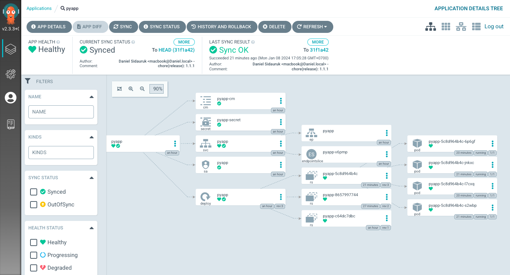

# cloud-ops

## Description
1. Build **GCP** Infrastructure using **Terraform**.
2. Operating **Kubernetes** in GKE Using **Helm**.
3. Continuous Integration using **Cloud Build** and Continuos Delivery using **ArgoCD**.

## The workflow landscape


## Argo CD


## Installation
**Clone the Repository:**
```
git clone https://github.com/danielsidauruk/cloud-ops.git && cd cloud-ops
```

**Export GCP Project ID**
```
export GOOGLE_CLOUD_PROJECT=`gcloud info --format="value(config.project)"`
```

**Run Setup Script**
```
chmod +x setup.sh && ./setup.sh
```

**Destroy the Infrastructure**
```
terraform destroy
```