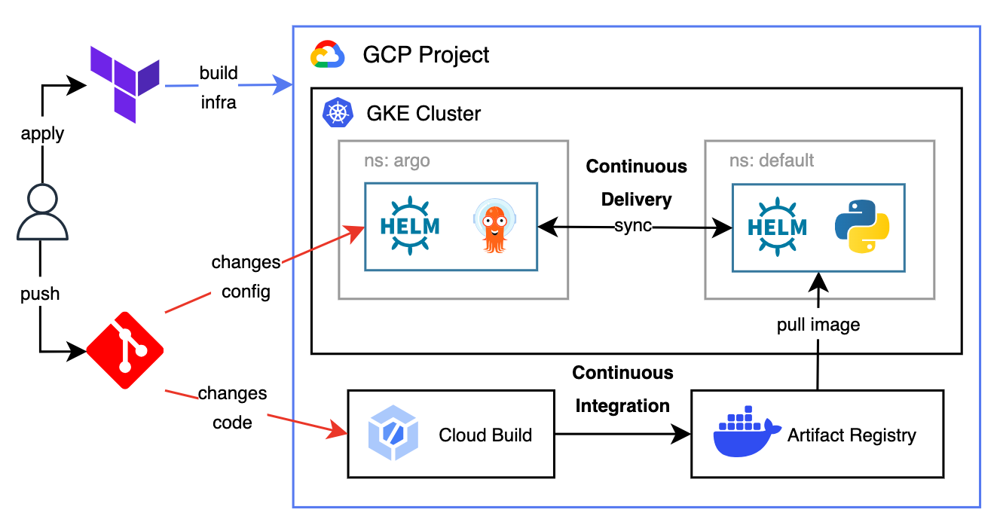

# cloud-ops
## Description
1. Build **GCP** Infrastructure using **Terraform**.
2. Operating **Kubernetes** in GKE Using **Helm**.
3. Continuous Integration using **Cloud Build** and Continuos Delivery using **ArgoCD**.

## The workflow landscape
